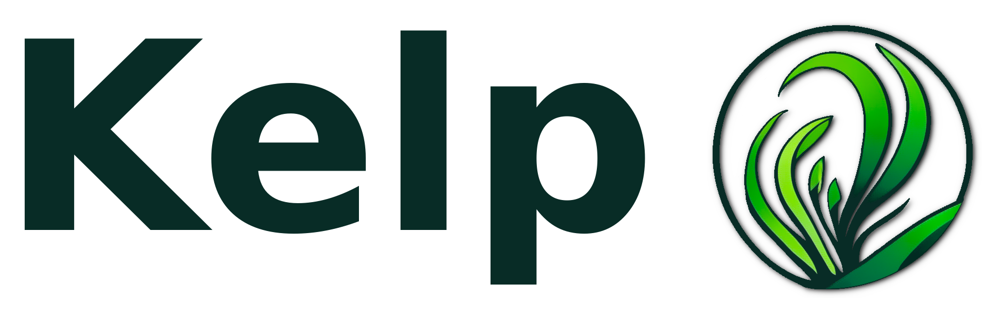

<div align="center" width="100%">
    <p></p>
    <p><b>A web framework light, yet rich in nutrients</b></p>
</div>

Kelp is a Perl web framework focused on Plack application toolkit. It's lean,
fast and extensible.


## Installation
Kelp is [distributed through CPAN](https://metacpan.org/release/Kelp). It can
be installed through a local CPAN client, for example:

```sh
cpanm Kelp
```

## Documentation
The Kelp manual can be viewed either online on
[metacpan](https://metacpan.org/pod/Kelp::Manual) or offline by
running a `perldoc Kelp::Manual` command. For detailed information, consult
documentation pages for specific parts of Kelp.

## Bugs and feature requests
Please use the Github's issue tracker to file both bugs and feature requests.

## Contributions
Contributions to the project in form of Github's pull requests are welcome.
Please make sure your code is in line with the general coding style of the
module. Let us know via a github issue if you plan something bigger so we can
talk it through.

### Author
Stefan Geneshky

### Contributors
In no particular order:

Julio Fraire

Maurice Aubrey

David Steinbrunner

Gurunandan Bhat

Perlover

Ruslan Zakirov

Christian Froemmel (senfomat)

Ivan Baidakou (basiliscos)

roy-tate

Konstantin Yakunin (@yakunink)

Benjamin Hengst (notbenh)

Nikolay Mishin (@mishin)

Bartosz Jarzyna (bbrtj)

## License

This module and all the modules in this package are governed by the same license
as Perl itself.

